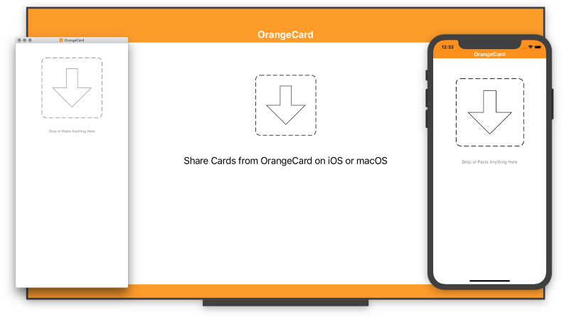
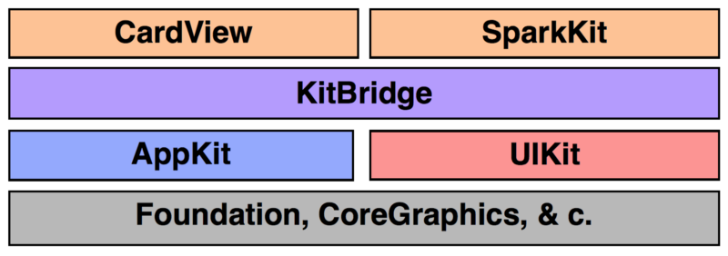

# KitBridge

KitBridge: Bringing UIKit and AppKit Closer Together

<small>From <a href="https://istumbler.net/labs/">iStumbler Labs</a></small>

## Goals

KitBridge allows you to create views which can be used in both iOS and macOS applications.

KitBridge supports <a href="https://gitlab.com/alfwatt/cardview">CardView</a> 
<a href="https://github.com/alfwatt/CardView">[Github]</a> and 
<a href="https://gitlab.com/alfwatt/SparkKit">SparkKit</a> 
<a href="https://github.com/alfwatt/SparkKit">[Github]</a>,
which offer a nice looking text view subclass, and a simple fast graphing toolkit.

Overall the goal of KitBridge is to provide *just enough* support to make writing apps which target
multiple platforms and UI modes easier, but withouth trying to emulate the iOS/tvOS app runtime on
macOS or vice versa.

Apps will have a single set of source files and one plist for each platform they want to target, along with 
storboards, xibs, xcassets and other platform specific resources. 

## Bridged Classes

Bridged classes are `#define` directives which allow you to write a kit class name, e.g.: `ILColor`
and when your app is complied, the appropriate `NS` or `UI` class from the `AppKit` or `UIKit` will
be substituted at compile time with no performance penalty.

    #define ILApplication UIApplication / NSApplication
    #define ILApplicationDelegate UIApplicationDelegate / NSApplicationDelegate
    #define ILBezierPath UIBezierPath / NSBezierPath
    #define ILButton UIButton / NSButton
    #define ILColor UIColor / NSColor
    #define ILFont UIFont / NSFont
    #define ILGradient NSObject / NSGradient
    #define ILImage UIImage / NSImage
    #define ILLabel UILabel / NSTextView
    #define ILPasteboard UIPasteboard / NSPasteboard
    #define ILProgressView UIActivityIndicatorView / NSProgressIndicator
    #define ILResponder UIResponder / NSResponder
    #define ILScreen UIScreen / NSScreen
    #define ILTextView UITextView / NSTextView
    #define ILTextField UITextField / NSTextField
    #define ILView UIView / NSView
    #define ILWindow UIWindow / NSWindow

The `#defines`  `IL_UI_KIT` and `IL_APP_KIT` can be used to segregate implementations when
needed, e.g. ILApplicationDelegates might use them to initialize the app for each platform in their 
`main(...)` function:

    #include <KitBridge/KitBridge.h>

    int main(int argc, char* _Nonnull argv[]) {
    #ifdef IL_APP_KIT
        return NSApplicationMain(argc, (const char* _Nonnull*) argv);
    #elif IL_UI_KIT
        @autoreleasepool {
            return UIApplicationMain(argc, argv, nil, NSStringFromClass([SparkyDelegate class]));
        }
    #endif
    }

## Bridged Functions

A number of geometry and printing functions are included for conveniences, see `KitBridgeFunctions.h` for details.

## ILViews Interface

The ILViews interfaces defines the `initView` and `updateView` methods or ILView subclasses.

## Categories

Categories are defined on AppKit classes to provide adaption to various UIKit methods.

Applications can then use the UIKit interface throughout, with only a small performance
penalty on macOS for the bridge code.

### ILColor+KitBridge

- Adds CSS color string properties
- Adds complementary and contrasting color properties
- Adds CIColor property to AppKit
- Adds semantic colors from AppKit to UIKit

## Model Controller Multiple Views (MCMV)

Porting either an existing iOS or macOS app using KitBridge will be easier or harder depending
on how well the original code complies to the Model View Controller (MVC) design pattern.

In an MVC app with clean seperation adding supoprt for a new platform means adapting the
existing contoroller to the UI Idiom in use. This requres more code than a straight across port 
but allows for customization of the model to each environment. Here is the outline of an example
project using KitBridge:

- Example.xcodeproj
    - ExampleDelegate.h
    - ExampleDelegate.m
    - ExampleViewController.h
    - ExampleViewController.m
    - Resources
        - Localizable.strings
    - macOS
        - Info.plist
        - MainMenu.xib
        - ExampleView.xib
        - Example.xcassets
    - iOS
        - Info.plist
        - ExampleView.xib
        - Main.storyboard
        - LaunchScreen.storyboard
        - Example.xcassets
    - tvOS
        - Info.plist
        - ExampleView.xib
        - Main.storyboard
        - LaunchScreen.storyboards
        - Example.xcassets

Bridging NSViewController/UIViewController is desireable but Xcode will not recognize the subclasses in Interface Builder.
Instead the `ExampleController.h` needs to define the controller inside of `#if` blocks:

    #import <KitBridge/KitBridge.h>

    #if IL_APP_KIT
    @interface ExampleController : NSViewController <NSTableViewDataSource, NSTableViewDelegate>
    @property(nonatomic,retain) NSTableView* tableView;
    #elif IL_UI_KIT
    @interface ExampleController : UIViewController <UITableViewDataSource, UITableViewDelegate>
    @property(nonatomic,retain) UITableView* tableView;
    #endif
    
    . . .
    
    @end

In the implementation file the various protocols are defined inside of `#if` blocks for each platform (you could also have seperate `.m` files for each platform):

    #import "ExampleController.h"

    @implementation ExampleController
    
    #if IL_APP_KIT
    #pragma mark - NSViewController Overrides . . .
    #pragma mark - NSTableViewDataSource . . .
    #pragma mark - NSTableViewDelegate . . .
    #elif IL_UI_KIT
    #pragma mark - UIViewController Overrides . . .
    #pragma mark - UITableViewDataSource . . .
    #pragma mark - UITableViewDelegate . . .    
    #endif
    
    @end

## TODO Items

- cocoapods & c. package definitions
- swift bridging header
- open source example app (besides the CardView and SparkKit)
- Implement ILGradient on top of CGGradient on UIKit
- ILSparkMeterTextStyle on ILSparkStack needs to offset values in the view
- colorist: Add command line optoions to parse and convert colors

## License

    The MIT License (MIT)

    Copyright (c) 2017-2018 Alf Watt

    Permission is hereby granted, free of charge, to any person obtaining a copy
    of this software and associated documentation files (the "Software"), to deal
    in the Software without restriction, including without limitation the rights
    to use, copy, modify, merge, publish, distribute, sublicense, and/or sell
    copies of the Software, and to permit persons to whom the Software is
    furnished to do so, subject to the following conditions:

    The above copyright notice and this permission notice shall be included in all
    copies or substantial portions of the Software.

    THE SOFTWARE IS PROVIDED "AS IS", WITHOUT WARRANTY OF ANY KIND, EXPRESS OR
    IMPLIED, INCLUDING BUT NOT LIMITED TO THE WARRANTIES OF MERCHANTABILITY,
    FITNESS FOR A PARTICULAR PURPOSE AND NONINFRINGEMENT. IN NO EVENT SHALL THE
    AUTHORS OR COPYRIGHT HOLDERS BE LIABLE FOR ANY CLAIM, DAMAGES OR OTHER
    LIABILITY, WHETHER IN AN ACTION OF CONTRACT, TORT OR OTHERWISE, ARISING FROM,
    OUT OF OR IN CONNECTION WITH THE SOFTWARE OR THE USE OR OTHER DEALINGS IN THE
    SOFTWARE.
