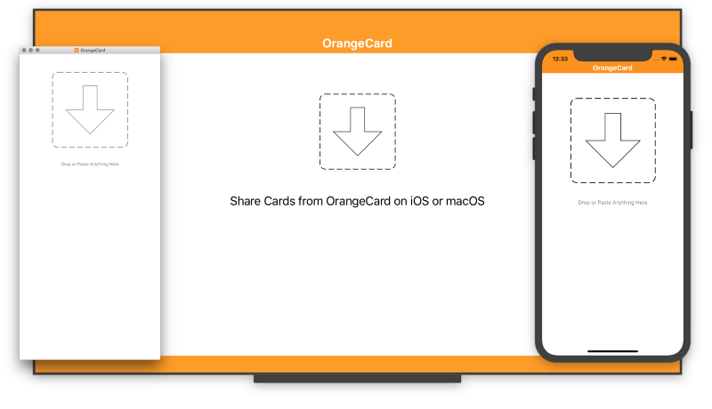
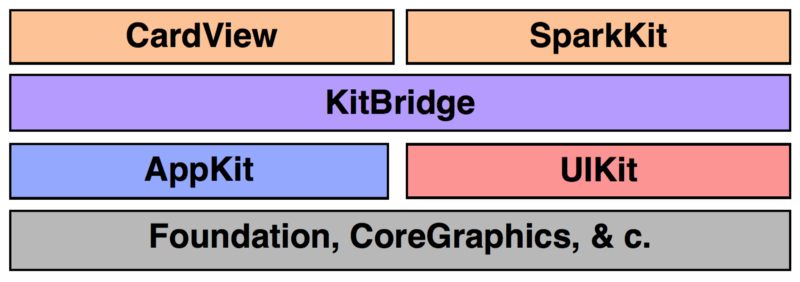

# KitBridge 

KitBridge: Bringing UIKit and AppKit Closer Together

From [iStumbler Labs](https://istumbler.net/labs/).

## Contents 

- [Goals](#goals)
- [Support](#support)
- [Classes](#classes)
- [Functions](#functions)
- [Protocols](#protocols)
- [Categories](#categories)
- [Swift](#swift)
- [Model Controller Multiple Views](#mcmv)
- [To Do Items](#todo)
- [Version History](#versions)
- [MIT License](#license)

## Goals 

KitBridge allows you to create views which can be used in both iOS and macOS applications.

KitBridge supports [CardView](https://github.com/iStumblerLabs/CardView), 
[SparkKit](https://github.com/iStumblerLabs/SparkKit),
which offer a nice looking text view subclass, and a simple fast graphing toolkit as well as
other iStumbler Labs frameworks.

Overall the goal of KitBridge is to provide *just enough* support to make writing apps which target
multiple platforms and UI modes easier, but without trying to emulate the iOS/tvOS app runtime on
macOS or vice versa.

Apps will have a single set of source files and one plist for each platform they want to target; 
along with storyboards, xibs, xcassets, and other platform specific resources.

## Support KitBridge! 

Are you using KitBridge in your apps? Would you like to help support the project and get a sponsor credit?

Visit our [Patreon Page](https://www.patreon.com/istumblerlabs) and patronize us in exchange for great rewards!

## Bridged Classes 

Bridged classes are `#define` directives in [`KitBridgeDefines.h`](./Sources/KitBridge/include/KitBridgeDefines.h)
which allow you to write a kit class name, e.g.: `ILColor` and when your app is complied, the appropriate 
`NS` or `UI` class from the `AppKit` or `UIKit` will be substituted at compile time with no performance penalty.

The `#if IL_UI_KIT` and `#if IL_APP_KIT` can be used to segregate implementations when needed, e.g. 
`ILApplicationDelegates` might use them to initialize the app for each platform in their `main(...)` function:

    #include <KitBridge/KitBridge.h>

    int main(int argc, char* _Nonnull argv[]) {
    #if IL_APP_KIT
        return NSApplicationMain(argc, (const char* _Nonnull*) argv);
    #elif IL_UI_KIT
        @autoreleasepool {
            return UIApplicationMain(argc, argv, nil, NSStringFromClass([SparkyDelegate class]));
        }
    #endif
    }

## Bridged Functions 

A number of geometry and printing functions are included for conveniences, see
[`KitBridgeFunctions.h`](./Sources/KitBridge/include/KitBridgeFunctions.h) for details.

## Protocols 

### ILViewLifecycle

The [`ILViewLifecycle`](./Sources/KitBridge/include/ILView+KitBridge.h) protocol defines the `-initView` and `-updateView` methods for `ILView` subclasses.

## Categories 

Categories are defined on AppKit classes to provide adaption to various UIKit methods.

Applications can then use the UIKit interface throughout, with only a small performance
penalty on macOS for the bridge code.

- [`ILApplication+KitBridge`](./Sources/KitBridge/include/ILApplication+KitBridge.h)
  - Adds `openURL:` method
- [`ILBezierPath+KitBridge`](./Sources/KitBridge/include/ILBezierPath+KitBridge.h)
  - Adds Path Description and Count functions and methods
  - Adds `enumeratePathWithBlock:` method
- [`ILButton+KitBridge`](./Sources/KitBridge/include/ILButton+KitBridge.h)
- [`ILColor+KitBridge`](./Sources/KitBridge/include/ILColor+KitBridge.h)
  - Adds CSS color string properties
  - Adds complementary and contrasting color properties
  - Adds CIColor property to AppKit
  - Adds semantic colors from AppKit to UIKit
- [`ILFont+KitBridge`](./Sources/KitBridge/include/ILFont+KitBridge.h)
  - Adds `-applicationFontFace:` along with `Info.plist` keys to define font faces for your application
- [`ILImage+KitBridge`](./Sources/KitBridge/include/ILImage+KitBridge.h)
  - Adds `@protocol ILImageResizing`
  - Adds `+imageForResource:` and `+imageForName:` to load images from the application bundle
- [`ILPDFImage`](./Sources/KitBridge/include/ILPDFImage.h)
- [`ILPaseboard+KitBridge`](./Sources/KitBridge/include/ILPaseboard+KitBridge.h)
- [`ILProgressView+KitBridge`](./Sources/KitBridge/include/ILProgressView+KitBridge.h)
- [`ILScreen+KitBridge`](./Sources/KitBridge/include/ILScreen+KitBridge.h)
- [`ILTextView+KitBridge`](./Sources/KitBridge/include/ILTextView+KitBridge.h)
- [`ILView+KitBridge`](./Sources/KitBridge/include/ILView+KitBridge.h)
  - Adds: `@protocol ILViewLifecycle` with `-initView` and `-updateView` methods
  - Adds: `-renderedImage` to provide a rendered 
  - Adds: `-replaceSystemFonts` on `ILView` which replaces standard system fonts with the application font faces
- [`NSBundle+KitBridge`](./Sources/KitBridge/include/NSBundle+KitBridge.h)
  - Adds: `-imageForResource:` and `-imageForName:` to load images from the application bundle

## Swift Support 

For applications that use Swift [`KitBridge.swift`](./Source/KitBridgeSwift/KitBridge.swift) 
is provided along with a generated `module.map` files in the Swift enabled products.

Swift applications can't see the `#defines` used to bridge classes for Objective-C code, 
so Swift `typealias` directives are used to allow the usage of the various `IL` type names.

Swift annotations like `@UIApplicationMain` and `@NSApplicationMain` can't be aliases so 
you'll need to include a `main.swift` file for the project:

    import Foundation
    import KitBridge

    #if os(macOS)
    NSApplicationMain(CommandLine.argc, CommandLine.unsafeArgv)
    #elseif os(iOS)
    let argv = UnsafeMutableRawPointer(CommandLine.unsafeArgv)
        .bindMemory(to: UnsafeMutablePointer<Int8>.self, capacity: Int(CommandLine.argc))
    UIApplicationMain(CommandLine.argc, argv, nil, "SwiftSettingsDelegate")
    #endif

### Swift Controller Views

To implement IL/NS/UIViewController

    #if os(iOS)
    import UIKit
    #elseif os(macOS)
    import AppKit
    #endif
    import KitBridgeSwiftf

    class ExampleView: ILViewController {
    }

## Model Controller Multiple Views (MCMV) 

Porting either an existing iOS or macOS app using KitBridge will be easier or harder depending
on how well the original code complies to the Model View Controller (MVC) design pattern.

In an MVC app with clean separation adding support for a new platform means adapting the
existing controller to the UI Idiom in use by creating Multiple Views, hence MCMV. This requires
more code and UI design time than an emulation environment but allows for customization of the
model to each UI idiom as closely as possible.

Here is the outline of an example project using KitBridge:

    - Example.xcodeproj
        - ExampleDelegate.h
        - ExampleDelegate.m
        - ExampleViewController.h
        - ExampleViewController.m
        - Resources
            - Localizable.strings
        - macOS
            - Info.plist
            - MainMenu.xib
            - ExampleView.xib
            - Example.xcassets
        - iOS
            - Info.plist
            - ExampleView.xib
            - Main.storyboard
            - LaunchScreen.storyboard
            - Example.xcassets
        - tvOS
            - Info.plist
            - ExampleView.xib
            - Main.storyboard
            - LaunchScreen.storyboards
            - Example.xcassets

Bridging `NSViewController`/`UIViewController` is desirable but unfortunately Xcode will not recognize the
subclasses in the Interface Builder due to indexing issues. Instead the `ExampleController.h` needs to define the controller
inside of `#if` blocks:

    #import <KitBridge/KitBridge.h>

    #if IL_APP_KIT
    @interface ExampleController : NSViewController <NSTableViewDataSource, NSTableViewDelegate>
    @property(nonatomic,retain) IBOutlet NSTableView* tableView;
    #endif
    /* Note the separate #if blocks, #elif confuses the Xcode indexer
       You may also have to swap the order of the blocks at design time, when setting up the xibs */
    #if IL_UI_KIT
    @interface ExampleController : UIViewController <UITableViewDataSource, UITableViewDelegate>
    @property(nonatomic,retain) IBOutlet UITableView* tableView;
    #endif
    
    . . .
    
    @end

In the implementation file the various protocols are defined inside of `#if` blocks for each platform
(alternately, you could also have separate `.m` files for each platform, or even use a base class with
platform specific subclasses):

    #import "ExampleController.h"

    @implementation ExampleController
    
    #if IL_APP_KIT
    // MARK: - NSViewController Overrides . . .
    // MARK: - NSTableViewDataSource . . .
    // MARK: - NSTableViewDelegate . . .
    #elif IL_UI_KIT
    // MARK: - UIViewController Overrides . . .
    // MARK: - UITableViewDataSource . . .
    // MARK: - UITableViewDelegate . . .    
    #endif
    
    @end

## Custom Fonts 

[`ILFont+KitBridge`](./Sources/KitBridge/include/ILFont+KitBridge.h) implements `-ILFont applicationFontFace:` 
and `-ILView replaceSystemFonts` which can replaces standard system fonts with custom fonts defined in
your apps `Info.plist`:

    <plist>
        <dict>
            <!-- the rest of your Info.plist... -->
            <key>ILFontRegularFace</key><string>Helvetica</string>
            <key>ILFontBoldFace</key><string>Helvetica-Bold</string>
            <key>ILFontLightFace</key><string>Helvetica-Light</string>
            <key>ILFontFixedFace</key><string>Monaco</string>
            <key>ILFontSerifFace</key><string>Georga</string>
        </dict>
    </plist>

Once configured you can call `-ILView replaceSystemFonts` on any view and KitBridge will recursively
descend the view hierarcy and replace all instances of the designated system fonts with the font
specified in the `Info.plist`

Additionally you can set `ILFontApplicationSize` with a `Number` in `Info.plist` to set the default
font size, or set it as a `NSUserDefaults` key to be used when replacing fonts. 

## To Do Items 

- open source example app (besides the CardView and SparkKit)
- Implement ILGradient on top of CGGradient on UIKit
- ILSparkMeterTextStyle on ILSparkStack needs to offset values in the view
- colorist: Add command line options to parse and convert colors

## Version History 

- `2.1.2` : [29 Apr 2025]()
  - `templateTintedWithColor:` → `imageWithTintColor:` on macOS
  - Add `sendAction:to:from:` to `UIApplication`
  - Fix `-rangesForAttribute:value:` to return correct ranges for attributes with
  multiple values (e.g. `NSFontAttributeName` with multiple fonts in the same string)
  
- `2.1.1` : [28 Apr 2025]()
  - No pasteboard equality on iOS (really this time)
  - Fix `rangesForAttribute:`
  
- `2.1.0` : [20 Apr 2025]()
  - Adds `-initWIthCGImage:` to `ILImage`
  - Adds `-rangesForAttribute:value:` to `NSAttributedString`
  - Adds `-replaceAttributes:value:newValue:` to `NSAttributedString`
  - Adds `-attributeRuns` to `NSTextStorage` on iOS 
  - The Struggle for Pasteboard Equality has failed on iOS
  
- `2.0.0`
  - Remove Foundation categories to [ILFoundation](https://github.com/alfwatt/ILFoundation.git)
  
- `1.3.1`
  - Swift Package Manager Support
  
- `1.3`: [25 Jan 2023](https://github.com/alfwatt/KitBridge/releases/tag/1.3) 
  - Modernize Build Settings with minimum 10.14 targets for most platforms
  - Removed ILWebView and WebKit dependency
  - Adds IL/UI/NSStoryboard
  - Adds IL/UI/NSCollectionView/Item/Delegate
  - Adds ILCGPath to ILBezierPath
  
- KitBridge `1.2.1` : [21 Jun 2022](https://github.com/alfwatt/KitBridge/releases/tag/1.2.1) 
  - Fix Packaging

- KitBridge `1.2`: [13 Jun 2022](https://github.com/alfwatt/KitBridge/releases/tag/1.2)
  - Add Swift Package Manager Support

- KitBridge `1.1`: [17 Aug 2018](https://github.com/alfwatt/KitBridge/releases/tag/1.1)  

- KitBridge `1.0`: 19 Jan 2018 —

- KitBridge `beta`: 22 May 2017

## Using KitBridge in your App

- Clone the latest sources: `git clone https://github.com/iStumblerLabs/KitBridge.git`
  near or inside your application's source
- Drag `KitBridge.xcodproj` into your project
- include the `KitBridge.framework` in your applications `Resources/Frameworks` directory
    - link the appropriate version of `KitBridge.framework` to all the targets which it

## Swift Package 

A Swift Package is defined in `Package.swift` for projects using Swift Package Manager, 
you can include the following URL in your project to use it:

    https://github.com/iStumblerLabs/KitBridge.git

## License 

    The MIT License (MIT)

    Copyright © 2017-2025 Alf Watt <alf@istumbler.net>

    Permission is hereby granted, free of charge, to any person obtaining a copy
    of this software and associated documentation files (the "Software"), to deal
    in the Software without restriction, including without limitation the rights
    to use, copy, modify, merge, publish, distribute, sublicense, and/or sell
    copies of the Software, and to permit persons to whom the Software is
    furnished to do so, subject to the following conditions:

    The above copyright notice and this permission notice shall be included in all
    copies or substantial portions of the Software.

    THE SOFTWARE IS PROVIDED "AS IS", WITHOUT WARRANTY OF ANY KIND, EXPRESS OR
    IMPLIED, INCLUDING BUT NOT LIMITED TO THE WARRANTIES OF MERCHANTABILITY,
    FITNESS FOR A PARTICULAR PURPOSE AND NONINFRINGEMENT. IN NO EVENT SHALL THE
    AUTHORS OR COPYRIGHT HOLDERS BE LIABLE FOR ANY CLAIM, DAMAGES OR OTHER
    LIABILITY, WHETHER IN AN ACTION OF CONTRACT, TORT OR OTHERWISE, ARISING FROM,
    OUT OF OR IN CONNECTION WITH THE SOFTWARE OR THE USE OR OTHER DEALINGS IN THE
    SOFTWARE.
